# Безопасность данных компании «Медикаменте»

Клиника переходит от общих файлов и ручного учёта к единой системе с личным
кабинетом пациента. Решение рассчитано на небольшую IT-команду и ожидаемый
пятикратный рост данных. Исходный объём и число пациентов неизвестны.
API — программный интерфейс обмена между системами; HTTPS шифрует этот обмен
с помощью TLS. ТМЦ — товарно-материальные ценности.

## Документы и реализация

| Материал | Где посмотреть |
| :--- | :--- |
| Конфиденциальные и неучтённые данные | [Классификация](#данные-для-защиты) |
| Аудит мер безопасности и список проблем | [problem-list.md](problem-list.md) |
| Потоки данных и меры защиты | [Шесть процессов](#потоки-данных), [draw.io — 12 страниц](medikamente-dfd.drawio), [SVG](diagrams/) |
| Способы и инструменты защиты | [Матрица защиты](#способы-и-инструменты-защиты) |
| Механизм тегирования | [Метки и правила обработки](#тегирование-данных) |

## Данные для защиты

В исходном описании подтверждены общий диск, ручная обработка, двойной учёт
платежей и отсутствие аудита и ограничений доступа кроме доменного входа.
Локальные копии, вложения почты и бумажные анкеты — возможные неучтённые данные,
которые нужно найти при инвентаризации. Настройки шифрования и резервного
копирования не описаны: их отсутствие нельзя считать установленным фактом.

| Категория | Примеры и место хранения сейчас | Что может оставаться вне учёта |
| :--- | :--- | :--- |
| Персональные данные | ФИО, дата рождения, телефон, почта, адрес; анкеты и сканы на общем диске | Копии анкет и сканов на рабочих местах, бумажные оригиналы |
| Медицинские данные | Жалобы, заболевания, заключения, анализы; карты и реестры в Excel и сканах | Вложения и копии результатов; связь пациента с записью к врачу тоже чувствительна |
| Финансовые и кадровые данные | Оплаты, договоры, зарплаты и налоги; Excel и «1С:Бухгалтерия» | Дубли кассовых записей, выгрузки бухгалтерии |
| Служебные данные | Учётные записи, настройки доступа, учёт ТМЦ в «1С:Торговля и склад» | Файлы настроек и пароли в документах, если они используются |
| Производные данные | Отчёты по Excel, расчёты аналитика в Jupyter/Python | Промежуточные таблицы и копии исходных данных без владельца и срока удаления |

Для найденного набора достаточно простого реестра: **название → место хранения
→ владелец → категория → разрешённые роли → срок хранения**. Копии и выгрузки
также включаются в реестр. Место работы или учёбы не запрашивается в общей
анкете без конкретной цели; сведения о заболеваниях собираются в медицинской
части системы и недоступны ресепшену.

## Основа целевого решения

Порталы сотрудников и пациентов используют единое приложение с модулями записи,
медкарты, оплаты и лаборатории. Структурированные данные хранятся в PostgreSQL,
документы — в закрытом файловом хранилище и выдаются через приложение.
«1С» сохраняется для бухгалтерии, кадров и склада. Разделение модулей
не требует отдельных сервисов.

| Принцип | Как применяется |
| :--- | :--- |
| Privacy by Design — защита по умолчанию | Новые данные закрыты; сервер проверяет права перед чтением, изменением и выгрузкой |
| Data Minimization — минимум данных | Формы и интеграции передают только поля, необходимые получателю |
| Data Lineage — происхождение данных | Для загрузки или выгрузки записываются источник, получатель, время и версия преобразования |

Роли: пациент видит свои сведения; ресепшен — контакты и записи;
врач — карты пациентов, к лечению которых он назначен; кассир — счета и оплаты;
бухгалтер — финансовые и кадровые документы; склад — ТМЦ; аналитик — подготовленные
отчёты. Привилегированный доступ администратора используется отдельно
от повседневной работы и журналируется. Проверка принадлежности записи выполняется
на сервере, даже если идентификатор пациента подменён в запросе.

## Потоки данных

DFD (Data Flow Diagram) показывает участников, операции, хранилища и передаваемые
данные. Прямоугольники — участники, скруглённые блоки — операции, открытые справа
блоки — хранилища. Красным выделены риски, зелёным — предлагаемые меры.
Категории чувствительности подписаны в хранилищах отдельно от цвета:
«Личные», «Медицинские», «Финансовые». Сводные бизнес-данные остаются внутренними.
Подход к обозначениям: [руководство Lucidchart](https://lucid.co/diagram/dfd/tutorial).

Каждая пара показывает текущий (As-Is) и целевой (To-Be) поток одного процесса.
Хранилища могут повторяться между схемами: это те же данные, а не отдельные базы.
Идентификаторы блоков действуют только в пределах своей схемы.
Чтение и запись показаны в пределах рассматриваемого процесса.

| Процесс | Сейчас | Предлагаемое изменение | Схемы в полном размере |
| :--- | :--- | :--- | :--- |
| 1. Регистрация | Анкеты и сканы на общем диске | Минимальная форма, метки данных, закрытое хранение | [As-Is](diagrams/dfd-p1-registration-as-is.svg) / [To-Be](diagrams/dfd-p1-registration-to-be.svg) |
| 2. Запись на приём | Общие Excel-журналы | Свободные слоты без ФИО; доступ к записи по роли и пациенту | [As-Is](diagrams/dfd-p2-scheduling-as-is.svg) / [To-Be](diagrams/dfd-p2-scheduling-to-be.svg) |
| 3. Медицинский приём | Карты и заключения в файлах | Доступ назначенного врача, история изменений и аудит | [As-Is](diagrams/dfd-p3-consultation-as-is.svg) / [To-Be](diagrams/dfd-p3-consultation-to-be.svg) |
| 4. Лаборатория | Ручной учёт анализов; канал обмена не описан | HTTPS API с учётными данными интеграции и кодом заказа | [As-Is](diagrams/dfd-p4-lab-as-is.svg) / [To-Be](diagrams/dfd-p4-lab-to-be.svg) |
| 5. Оплата | Дубли в Excel и 1С, связь 1С с кассой | Один реестр оплат в 1С, передача счёта и статуса через API | [As-Is](diagrams/dfd-p5-payment-as-is.svg) / [To-Be](diagrams/dfd-p5-payment-to-be.svg) |
| 6. Аналитика | Ручные расчёты по Excel | Загрузка по расписанию, удаление идентификаторов и сводные отчёты | [As-Is](diagrams/dfd-p6-analytics-as-is.svg) / [To-Be](diagrams/dfd-p6-analytics-to-be.svg) |

### 1. Регистрация

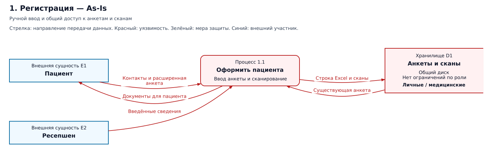
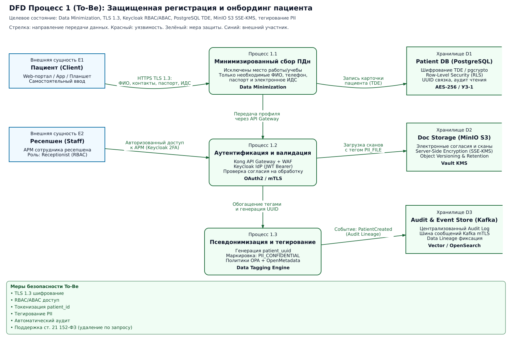

### 2. Запись на приём

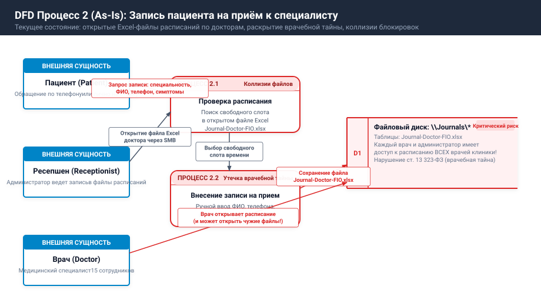


### 3. Медицинский приём

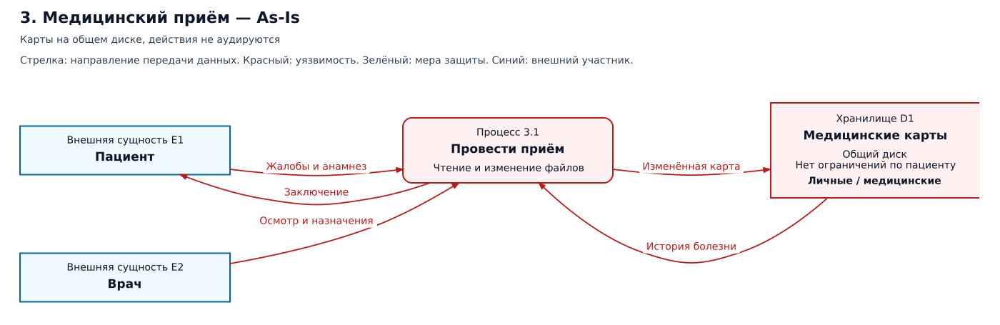
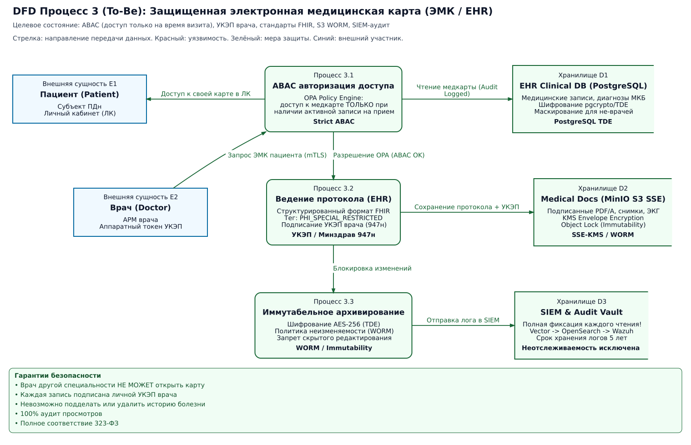

### 4. Лаборатория

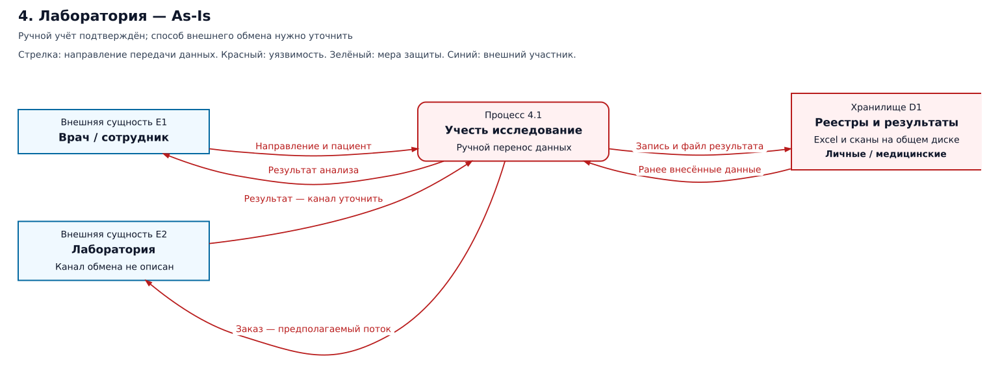
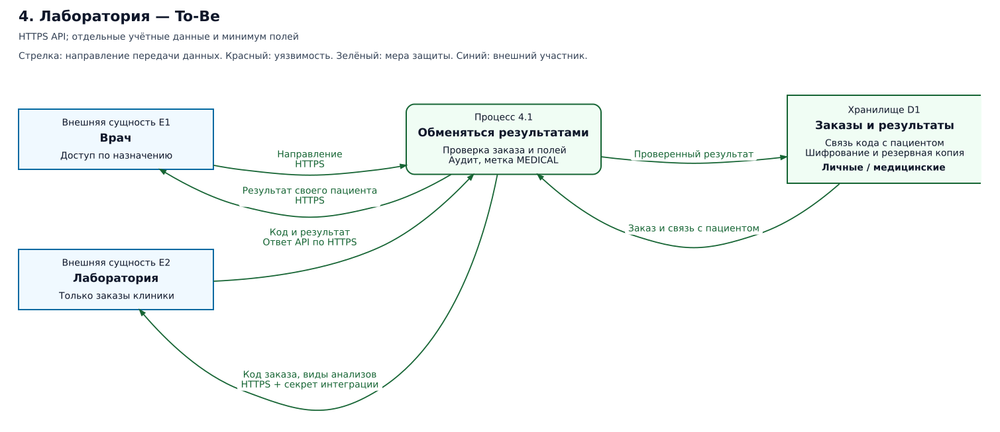

Приложение отправляет заказ и периодически запрашивает результат по HTTPS
с проверкой сертификата сервера. Отдельный секрет интеграции хранится
в защищённых настройках сервера, ограничен операциями с заказами клиники
и заменяется при компрометации. Код заказа сопоставляется с пациентом внутри
клиники. Это замена идентификатора, а не полное обезличивание. Состав полей
нужно согласовать с лабораторией; произвольно исключать необходимые ей сведения
нельзя. Повторно полученный результат обновляет тот же заказ, не создавая дубль.

### 5. Оплата

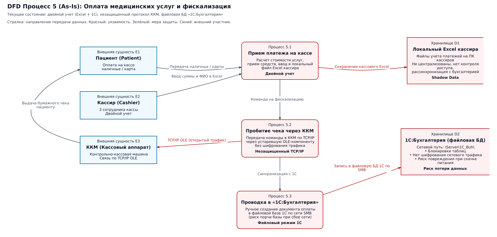
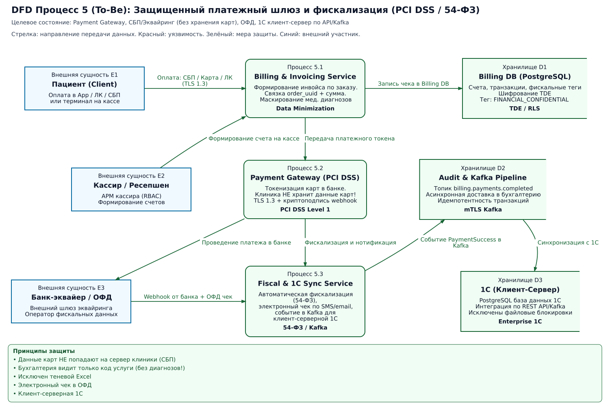

Онлайн-оплата проходит на странице платёжного провайдера; реквизиты карты
не попадают в приложение клиники. Статус проверяется сервером у провайдера,
повторы учитываются по идентификатору платежа. В 1С передаются только данные
для учёта и чека. Для API потребуется серверная публикация 1С;
возможности текущей версии и кассового драйвера нужно проверить. Касса остаётся
в выделенном сегменте сети; доступ к ней разрешён только узлу 1С.

### 6. Аналитика

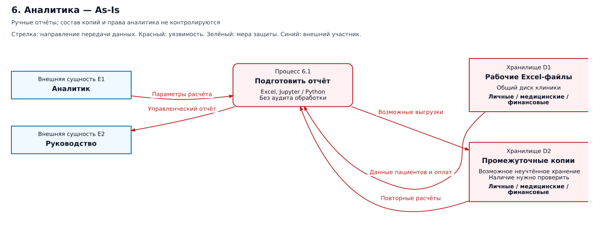
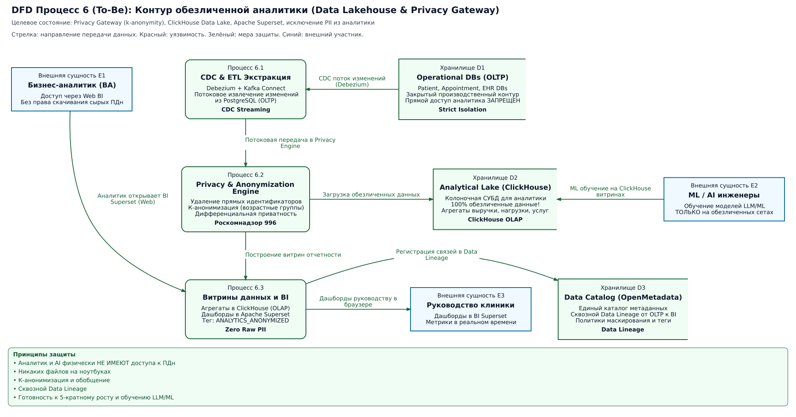

На первом этапе достаточно серверного скрипта Python/SQL по расписанию:
загрузка Excel в закрытый каталог, проверка полей, удаление прямых идентификаторов
и подготовка сводных таблиц в отдельной аналитической БД PostgreSQL.
После перехода на приложение источником становится рабочая БД. Скрипт работает
под отдельной учётной записью с ограниченным чтением; аналитик не получает
доступ к исходным картам. Загрузка выполняется вне часов приёма, её длительность
измеряется при росте данных.

Это начальный слой будущего озера данных: закрытые исходные файлы и проверенные
наборы для анализа. Для текущих бизнес-отчётов достаточно сумм и количества услуг
по периоду и филиалу. Редкие группы укрупняются или скрываются, свободный текст
медкарт не выгружается. Удаление ФИО само по себе не гарантирует обезличивание.
Наборы для будущего машинного обучения и языковых моделей требуют отдельной
проверки риска повторного определения пациента.

## Способы и инструменты защиты

| Данные / этап | Способ защиты | Простая реализация |
| :--- | :--- | :--- |
| Все внешние запросы и обмен с 1С | Шифрование передачи, проверка получателя и прав | HTTPS через Nginx; роли и проверка конкретной записи в приложении; ограниченные учётные данные интеграций |
| База, документы, резервные копии | Шифрование хранения, ограничение доступа, восстановление | Шифрование томов средствами ОС, например LUKS или BitLocker; отдельная зашифрованная резервная копия и проверка восстановления; ключ восстановления хранится отдельно |
| Контакты, анкеты, договоры | Минимизация, маскирование (обфускация) | Скрытый номер телефона там, где полный не нужен; исходное значение выдаётся только разрешённой роли |
| Медкарты, анализы и записи | Доступ по назначению, контроль изменений | Проверка роли и связи с пациентом, версии документов, журнал чтений и изменений без текста диагнозов |
| Обмен с лабораторией | Замена идентификаторов и минимизация | Случайный код заказа; таблица соответствий внутри клиники; разрешённый перечень полей API |
| Оплаты, зарплаты и кадровые сведения | Разделение ролей и сокращение копий | Права 1С; отсутствие медицинских заключений в бухгалтерском обмене; отказ от кассовых Excel-дублей |
| Аналитические наборы | Обезличивание перед выдачей | Python/SQL: убрать контакты и идентификаторы, агрегировать, проверить редкие сочетания; метки и журнал загрузок |
| Учётные записи и журналы | Защита входа, контроль действий | Доменный вход сотрудников; второй фактор для администраторов и удалённого доступа; отдельный сбор журналов и оповещение о массовых чтениях/отказах доступа |

Шифрование диска защищает выключенный носитель; оно не заменяет права доступа
на работающем сервере. Соединения с БД по сети также шифруются. Журналы содержат
пользователя, действие, код объекта, время и результат, но не содержимое документов
и секреты. Пользователь приложения не может изменять журнал аудита.
Базовые меры защиты API согласуются с [рекомендациями OWASP](https://cheatsheetseries.owasp.org/cheatsheets/REST_Security_Cheat_Sheet.html).

Мониторинг сообщает ответственному сотруднику о сбоях лабораторного обмена,
оплат и аналитических загрузок. Для этих потоков измеряются длительность,
число ошибок и время последнего успешного обмена. Права и журнал доступа
регулярно пересматриваются; пороги уведомлений задаются после первых замеров.

Для каждой категории назначается срок хранения и ответственный. По запросу
пациента прекращается обработка, для которой больше нет основания; данные,
подлежащие обязательному хранению, ограничиваются в доступе. Удаление охватывает
рабочие данные, выгрузки и истекающие резервные копии; после восстановления
повторно применяются ранее зарегистрированные ограничения и удаления.
Конкретные сроки, основания и порядок электронного подписания медицинских
документов нужно определить до запуска.

## Тегирование данных

Тег — метка категории данных, по которой приложение выбирает правила обработки.
Для известных полей достаточно небольшого словаря YAML в репозитории,
загружаемого библиотекой PyYAML. Владелец данных вместе
с разработчиком задаёт метки полей БД, API и типов документов.

| Метка | Примеры | Правило |
| :--- | :--- | :--- |
| `PERSONAL` | ФИО, телефон, идентификатор пациента | Не писать значения в логи; маскировать или удалять при выгрузке |
| `MEDICAL` | Диагноз, анализ, связь пациента с приёмом | Карты — пациенту и назначенному врачу; ресепшену — только данные записи; журналировать чтение |
| `FINANCIAL` | Платёж, зарплата | Доступ кассира/бухгалтера в пределах функций; в аналитику — суммы |
| `INTERNAL` | Настройки, служебные записи | Доступ только назначенным сотрудникам; секреты не выгружать |

Пример записи в словаре: `patient.phone: [PERSONAL]`,
`lab_result: [PERSONAL, MEDICAL]`. Документ получает метки при загрузке;
они хранятся вместе с его идентификатором в PostgreSQL. Несколько меток
применяются совместно, более слабая не отменяет ограничений другой.

1. **Описание.** Словарь связывает поле/тип документа с меткой. Для описания API
   используются собственные поля `x-data-tags` в OpenAPI; это расширение проекта,
   а не встроенная защита. [Спецификация OpenAPI](https://spec.openapis.org/oas/v3.1.1.html#specification-extensions)
   допускает такие расширения.
2. **Применение.** Общий модуль приложения проверяет права и исключает запрещённые
   поля из ответа. Скрипт аналитики использует тот же словарь. Метки сами
   по себе доступ не ограничивают. Неизвестное поле или документ остаётся закрытым
   для внешней выдачи и аналитики до проверки владельцем.
3. **Контроль.** Автоматическая проверка перед релизом сверяет поля со словарём
   и проверяет выдачу чужой записи, маскирование и состав выгрузки. Ошибка блокирует
   выпуск. Во время работы неизвестные поля и отказы проверок попадают в мониторинг.
4. **Прослеживаемость.** При выгрузке сохраняются источник, получатель, дата,
   версия правил и метки результата. Снять чувствительную метку можно только
   после проверки преобразования; переименование столбца её не отменяет.

## Редактирование схем

SVG и draw.io используют общий источник: [описания потоков](generate_diagrams.py),
[компоновку](diagram_layout.py) и [экспорт draw.io](generate_drawio.py).
Для повторной генерации из корня проекта нужны Python 3 и Graphviz (`dot`):

```bash
python3 Task1/generate_diagrams.py
python3 Task1/generate_drawio.py
```

При изменении процесса обновляются его описание и обе схемы. Перед внедрением
источники, получатели и состав полей сверяются с ресепшеном, врачами,
бухгалтерией, аналитиком и представителем лаборатории; затем проверяются
права, ошибочные и повторные сообщения и восстановление данных.
