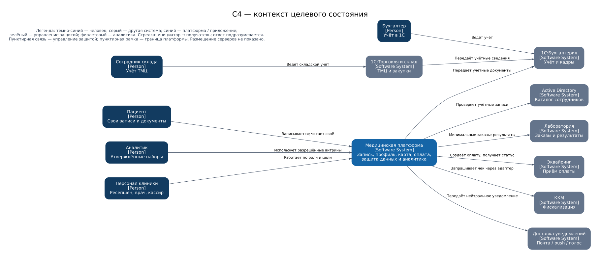
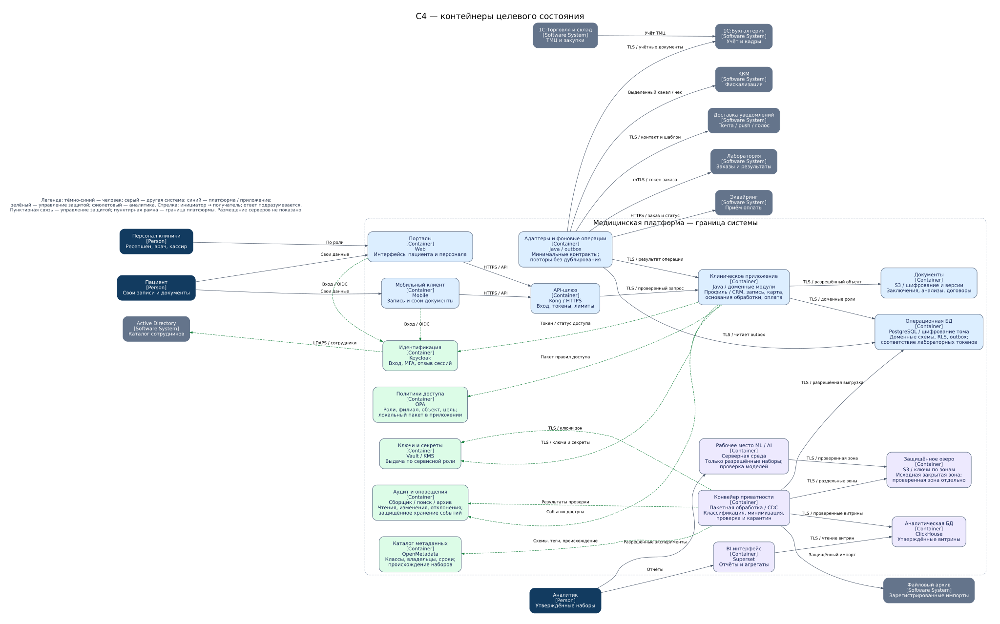

# Целевая архитектура «Медикаменте»

Единая медицинская платформа объединяет запись на приём, профиль пациента,
медицинские документы и учёт оплаты. Защита данных встроена в хранение,
проверку доступа, интеграции и аналитическую обработку.

## Документы и реализация

- [Контекст C4 и контейнеры целевого состояния — редактируемый draw.io](medikamente-target.drawio).
- [Контекст C4 — SVG](diagrams/c4-context.svg).
- [Контейнеры C4 — SVG](diagrams/c4-containers.svg): новые блоки защиты и аналитический слой.
- [Архитектурные решения, права доступа, риски и критерии проверки](architecture.md).
- [Генератор схем](generate_diagrams.py): `python3 Task2/generate_diagrams.py`
  из корня репозитория; необходимы Python 3 и Graphviz (`dot`).

## Контекст системы

Пациент работает только со своими записями и документами. Сотрудники используют
данные в пределах своих обязанностей. Лаборатория, эквайринг и доставка уведомлений
получают минимальные наборы данных через выделенные адаптеры. Существующие 1С
остаются самостоятельными системами бухгалтерского и складского учёта.

## Внутреннее устройство

Обе схемы описывают одно целевое состояние. Контекст показывает людей и системы;
вторая схема раскрывает приложения и хранилища внутри медицинской платформы.
Стрелки обозначают инициатора взаимодействия и содержат его назначение;
ответы подразумеваются. Пунктирные связи относятся к управлению безопасностью.
Схемы не задают физическое размещение и число серверов.
