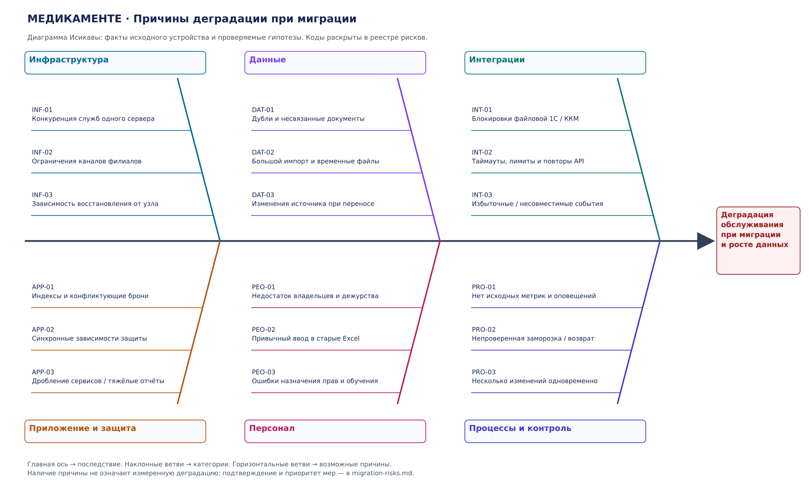

# Узкие места миграции «Медикаменте»

Переход от файлового учёта к медицинской платформе затрагивает качество данных,
серверы и сеть, бизнес-логику, внешние интеграции и работу персонала.
Диаграмма Исикавы связывает возможные причины с общим последствием:
деградацией обслуживания при миграции и росте объёма данных.

## Документы и реализация

- [Диаграмма Исикавы — редактируемый draw.io](migration-ishikawa.drawio).
- [Диаграмма Исикавы — SVG](diagrams/migration-ishikawa.svg).
- [Анализ компонентов, реестр проблем, рекомендации и приоритеты](migration-risks.md).
- [Генератор диаграммы](generate_diagram.py): `python3 Task4/generate_diagram.py`
  из корня репозитория; достаточно стандартной библиотеки Python 3.

## Причины деградации

Шесть ветвей охватывают инфраструктуру, данные, интеграции, приложение и защиту,
персонал, процессы и контроль. Коды на схеме соответствуют реестру рисков.
Схема представляет причинные гипотезы, а не результаты нагрузочного измерения.
