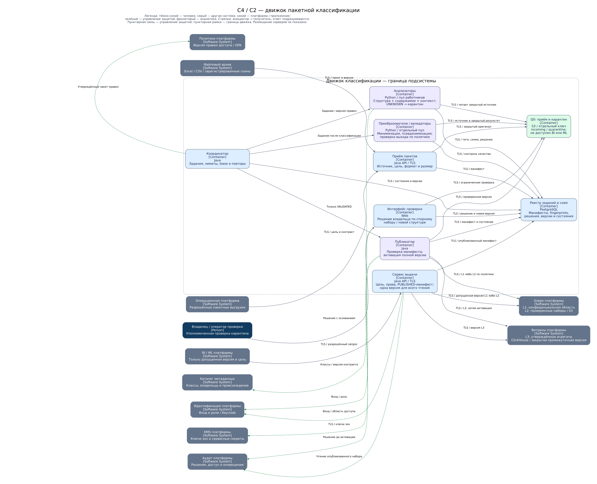

# Классификация перед загрузкой в аналитическое хранилище

Движок принимает неразмеченные пакетные данные, определяет их чувствительность,
отслеживает изменения структуры и допускает публикацию только после проверки.
Неизвестные и спорные данные остаются в закрытой зоне. Конфиденциальные наборы
хранятся отдельно от общих аналитических витрин.

## Документы и реализация

- [Диаграмма C2 движка — редактируемый draw.io](classification-engine.drawio).
- [Диаграмма C2 — SVG](diagrams/classification-engine-c2.svg).
- [Проект движка, изменения схем, слои хранения, метрики и масштабирование](engine-design.md).
- [Генератор диаграммы](generate_diagram.py): `python3 Task6/generate_diagram.py`
  из корня репозитория. Нужны Python 3 и Graphviz; переиспользует
  [экспорт C4 из Task2](../Task2/generate_diagrams.py).

## Контейнеры и потоки

C2 здесь означает второй уровень C4 — приложения и хранилища подсистемы
классификации. Обобщённый конвейер приватности из целевой архитектуры раскрыт
в отдельно запускаемые приложения приёма, анализа, преобразования и публикации.
Это проектное решение; промышленная реализация движка не входит в эти материалы.
