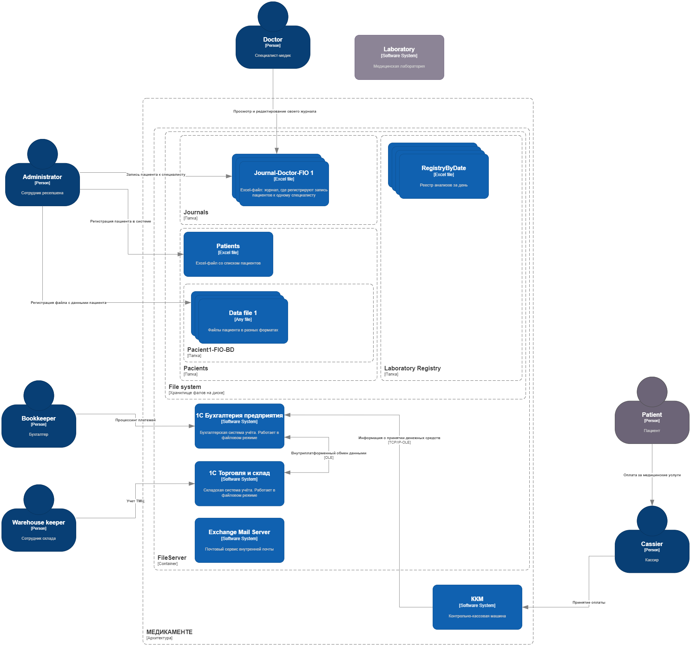

# Описание проектной работы 10 спринта

Этот проект будет посвящён кейсу компании «Медикаменте». Для начала необходимо познакомиться с самой компанией — чем она занимается и с какими проблемами сталкивается.

## О компании

Компания «Медикаменте» предоставляет медицинские услуги. Сейчас у компании есть один офис, в котором работают 20 административных сотрудников и 15 медицинских специалистов.

Все операции с данными команда производит вручную.

- **Журналы приёма пациентов, учёт пациентов и платежей, медицинские карты, учёт анализов** ― в файлах Excel или хранят в виде сканов. Материалы лежат на общем диске.
- **Учёт денежных средств** — в «1С:Бухгалтерия предприятия». С ней интегрированы контрольно-кассовые машины (ККМ).
- **Учёт товарно-материальных ценностей (ТМЦ)** — в «1С:Торговля и склад». Программа интегрирована с «1С:Бухгалтерия предприятия».

В этом году компания собирается открывать новые филиалы. Руководство ожидает, что число клиентов кратно возрастёт.

Ваша задача — автоматизировать всю работу таким образом, чтобы компания смогла поддержать пятикратный рост объёма данных и расширение команды.

Поскольку «Медикаменте» будет активно нанимать новых сотрудников, необходимо усилить безопасность медицинских карт. Они содержат конфиденциальные данные, которые необходимо защитить от несанкционированного доступа и утечек.

В будущем компания хочет уйти от ручной записи клиентов и перейти на единую систему хранения и управления данными. Она объединит журналы приёма пациентов, учёт пациентов и учёт оплаты услуг. Планируется, что система будет поддерживать мобильное приложение, в котором клиенты смогут самостоятельно записаться к врачу через личный кабинет (ЛК).

## Проблемы компании

Компания обслуживает пациентов на территории Российской Федерации. Технический директор «Медикаменте» видит, что работа с конфиденциальными данными и PII не в полной мере отвечает требованиям российского законодательства. Это создаёт репутационные и финансовые риски для компании. Если информация о нарушениях дойдёт до СМИ, «Медикаменте» потеряет доверие клиентов.

Исходя из этого, технический директор сформулировал две бизнес-потребности.

- Изменить парадигму хранения и учёта конфиденциальных данных. Она должна соответствовать принципам и требованиям законодательства РФ.
- Снизить риски утечки данных, чтобы увеличить доверие и лояльность клиентов.

## Лендскейп компании

В «Медикаменте» шесть отделов:

- **Медицинские специалисты** — 15 человек.
- **Ресепшен** — 3 сотрудника. Ведут журнал записей к специалистам и заключают клиентские контракты.
- **Кассиры** — 3 сотрудника. Принимают платежи и ведут двойной учёт в Excel и 1C.
- **Бухгалтерия** — 3 сотрудника. Занимаются процессингом платежей и ведут бухгалтерию, которая связана с учётом кадров, выплатой зарплат и налогами.
- **Склад** — 3 сотрудника. Ведут учёт ТМЦ и закупок оборудования для медицинских кабинетов.
- **IT-отдел** — 3 специалиста: технический директор, администратор сети и бизнес-аналитик.

  - Технический директор выполняет функции архитектора. В его стек входят Java, Postgres, ClickHouse, Elastic, Kubernetes и Victoria Metrics.
  - Администратор сети может всё ― от починки принтера до развёртывания кластера Kubernetes.
  - Бизнес-аналитик умеет строить отчёты (P&L, ABC-анализ и другие) на основе Excel при помощи Jupiter и Python.

В рамках расширения бизнеса «Медикаменте» планирует открывать активный наём и увеличивать команду. Если для автоматизации процессов и усиления безопасности данных нужны новые сотрудники, руководство выделит необходимые ресурсы.

## Текущее состояние архитектуры

У технологической базы компании довольно простой ландшафт. Есть несколько бэк-офис-сервисов, которые закрывают разные потребности. Все IT-продукты построены на разных архитектурных принципах (монолит, общие ресурсы) и развёрнуты на собственном сервере компании. Он находится в том же здании, что и офис.

Технологический стек компании выглядит так:

- **Excel, Outlook и 1С.** Их используют для работы на компьютерах в локальной сети компании.
- **«1С:Бухгалтерия предприятия».** Программа работает в файловом режиме. Её используют для учёта платежей, начисления зарплаты, кадрового учёта и подготовки документации для налоговых органов.
- **«1С:Торговля и склад».** Тоже работает в файловом режиме. В этой программе ведут учёт товарно-материальных ценностей (ТМЦ).
- **Физический сервер с Microsoft Windows Server 2022.** На нём настроены Active Directory, DNS, DHCP, LDAP, файловый сервер, Exchange Mail Server. ККМ связаны с сервером через TCP/IP и компоненту 1С по технологии OLE.

[Вот диаграмма с архитектурой системы в модели C4](https://code.s3.yandex.net/software-architect/project10-landscape.drawio.xml):

Любой бизнес-процесс в компании сопровождается обращением к конфиденциальным данным разного уровня.

При взаимодействии с персоналом медицинского центра пациент указывает персональные данные, в том числе ― Ф. И. О., дату рождения, телефон и электронную почту. Ещё он может заполнить расширенную форму, которая включает вопросы об адресе прописки, месте работы или учёбы, хронических заболеваниях. Всю эту информацию сотрудники обрабатывают вручную.

«Медикаменте» использует локальные способы хранения данных. В основном это Excel, JPG и PDF. Результаты работы с данными сохраняются и читаются в файлах и IT-системах без аудита действий.

Внутренние потоки данных между IT-продуктами никак не контролируются. Ограничения по передаваемым данным обусловлены только бизнес-процессами компании. Кроме доменной аутентификации, со стороны систем обработки нет ограничений на доступ к данным.

## Цели бизнеса

Компания стремится обеспечить конфиденциальность, целостность и доступность данных — это приоритет «Медикаменте», который диктует подход к остальным трём целям компании.

### 1. Интеграция лаборатории анализов с API.

«Медикаменте» хочет настроить интеграцию лаборатории анализов с API. Требования к интеграции такие:

- API-контракты должны закрывать и скрывать категории данных, которые явно представляют конфиденциальные данные.
- Необходимо предотвратить использование API-контрактов, позволяющих третьим лицам выполнять действия и получать данные внешним пользователям, которые они не должны иметь возможности получить. Например, один пациент не должен иметь возможность увидеть данные другого пациента.
- В будущем компания планирует развивать сервисы для клиентов, в том числе за счёт интеграций с партнёрами. Поэтому необходимо выстроить такой подход к работе с данными по умолчанию, чтобы новые интеграции не приходилось перевалидировать.

### 2. Расширение направления обработки данных (новые сервисы на базе BI-, ML- и AI-технологий).

Компания накапливает данные, которые можно использовать для ведения бизнеса, извлекая из них знания и реализуя новые сервисы.

Сейчас сотрудникам очень неудобно обрабатывать данные, которые хранятся в Excel-файлах, так как такой формат подразумевает много ручной работы. Поэтому необходимо создать на основе этих файлов озеро данных, которое позволит автоматизировать построение BI, создание LLM и обучение AI на этих данных с применением ML.

### 3. Разработка новых систем и миграция.

Чтобы автоматизировать процессы, компания планирует разработать:

- портал для клиентов,
- портал для сотрудников ресепшена,
- платёжный шлюз,
- CRM для сбора данных о клиентах,
- интеграцию с лабораторией анализов.

**Промежуточное состояние (через пару месяцев).** MVP, в котором клиент сможет самостоятельно записаться на приём к специалисту через портал компании. При этом команда ресепшена будет видеть эту запись: сотрудники смогут отследить запись в системе и за день до приёма напомнить про него и пациенту, и специалисту. Необходимо определить категории данных пациентов и разнести их по различным доменам. Для каждой категории данных определить роли (RBAC) или атрибуты (ABAC), на основании которых сотрудникам будет разрешён доступ к данным.

**Финальное состояние (через год).** Полностью автоматический процесс записи к специалисту через портал и мобильное приложение. Пациенту приходят оповещения о записи через мобильное приложение или голосового робота. В ответ на оповещение клиент может подтвердить или отменить запись, при этом система отправляет оповещение на ресепшен. В мобильном приложении пациент может просматривать только свои данные (анализы, заключения, договор), у него нет доступа к данным других пациентов. В системе есть возможность помечать тегами данные, которые необходимо защитить. Релиз проверяется в автоматическом режиме на работу с тегированными данными, после чего информация передаётся в систему мониторинга и алертинга. В системе появилась возможность проводить аудит доступа к данным и отслеживать нетипичные действия пользователей. В случае несанкционированного доступа к данным команде приходят оповещения.

При разработке решения необходимо обеспечить следующие НФТ:

- **Безопасность (конфиденциальность).** Необходима гарантия того, что чувствительная информация будет безопасно храниться и обрабатываться. Чувствительные данные важно своевременно удалять. Если клиент обратится с соответствующим запросом, обработку его данных нужно прекратить.
- **Масштабируемость.** Система должна стабильно работать в условиях расширения бизнеса: компания открывает филиалы, нанимает десятки сотрудников и даёт клиентам возможность работать через мобильное приложение.
- **Сопровождаемость.** Нужно предусмотреть внесение изменений и улучшений в систему. Этот процесс должен быть простым и понятным.
- **Конфигурируемость.** В конфигурации можно вносить изменения без дополнительных доработок.

## Как подготовиться к работе

Подготовьте репозиторий, куда вы будете загружать решения заданий:

1. Проект этого спринта вы будете сдавать в Git-репозитории. Создайте публичный репозиторий в GitHub или GitLab. Назовите его «architecture-medikamente».
2. Проект состоит из нескольких заданий. Решение каждого задания нужно будет залить в отдельную директорию. Создайте в репозитории директории и назовите их «Task1», «Task2» и т. д.
3. Чтобы ревьюеру было проще проверять вашу работу, а вам — отслеживать изменения на разных итерациях, загрузите файлы в свой репозиторий и сделайте пул-реквест. На ревью нужно отправить ссылку именно на него.

Если репозиторий готов, можно приступать к заданиям!

## Задание 1. Анализ безопасности системы

Чтобы заниматься реализацией новых продуктов, которые основаны на данных, необходимо системно решить проблему хранения конфиденциальных данных и управления ими. Сейчас данные лежат в непосредственной близости к пользователям, поэтому существует риск утечки данных и неправомерного использования информации.

Чтобы защитить данные, используйте механизмы, инструменты и принципы работы с конфиденциальными данными, например, подходы Privacy By Design, Data Minimization и Data Lineage.

В рамках этого задания вам нужно проанализировать состояние As-Is, чтобы впоследствии приступить к его доработке.

### Что нужно сделать

1. **Выявите конфиденциальные данные, которые не учтены во внутренних системах.**

   - Проанализируйте информацию о компании.
   - Создайте диаграммы потоков данных (Data Flow Diagrams). Для каждого процесса создайте отдельную диаграмму.
   - Отобразите на них, как данные перемещаются по системам компании и какие операции над ними совершают.
2. **Проведите аудит мер по обеспечению безопасности данных.**

   - Сопоставьте процессы в компании с требованиями по обеспечению безопасности данных и архитектурными практиками в области безопасности конфиденциальных данных.
   - Составьте список проблемных зон и сохраните его в отдельный документ.
3. **Подумайте, что можно улучшить.**

   - Составьте список данных для защиты и проставьте для каждого способы защиты — шифрование, обфускация, обезличивание.
   - Разработайте механизм тегирования данных с использованием инструментов тегирования.
   - Составьте список инструментов, способов и мер, которые позволят обеспечить конфиденциальность данных в указанных потоках.
   - Доработайте диаграммы из предыдущего шага: отобразите на них, что следует использовать на каждом этапе потока.

При работе над диаграммами потоков данных ориентируйтесь на рекомендации, которые мы дали в уроке «Как управлять потоками данных», и [гайд от Lucidchard](https://www.lucidchart.com/blog/data-flow-diagram-tutorial).

Когда задание будет готово, загрузите диаграммы потоков данных и список проблем в директорию Task1 в рамках пул-реквеста.

## Задание 2. Проектирование решения

Используя подход Privacy by Design, проведите анализ и предложите механизмы для предупреждения возможных рисков, связанных с конфиденциальностью. Ваша задача — спроектировать механизмы управления такими рисками до момента реализации изменений в проектируемой системе.

В рамках этого задания вам нужно проанализировать состояние As-Is и оценить, как спроектировать решение с учётом требований To-Be.

### Что нужно сделать

1. Предложить новые блоки в архитектуру проектируемой системе С4, которые обеспечат соблюдение принципов Privacy By Design во многих блоках реализуемой системы.
2. Предложить в целевой архитектуре слой, который обеспечивает аналитическую работу с данными системы с учётом принципов Privacy by Design.

Когда задание будет готово, загрузите диаграмму контекста C4 целевого состояния системы в директорию Task2 в рамках пул-реквеста.

## Задание 3. Оценка Data Encryption at Rest and In Transit

Вам необходимо разработать стратегию защиты данных в рамках всей системы. При этом важно учесть особенности шифрования данных, которые находятся в разных состояниях — при хранении и во время передачи.

### Что нужно сделать

1. **Определить, какие данные нужно защитить**.

   Необходимо классифицировать информацию по состоянию, чувствительности, профилю риска и другим параметрам. Это поможет выбрать наиболее эффективные методы защиты.
2. **Реализовать базовые инструменты защиты**.

   Предложить инструменты защиты, которые нужно добавить в систему, чтобы обеспечить защиту данных.
3. **Использовать автоматизированный контроль**.

   Предложить средства для контроля за данными
4. **Подготовить реестр программных и аппаратных средств для защиты данных**.

В результате подготовьте классификацию данных, обоснование необходимости защиты выделенных классов и инструменты защиты данных.

Пример

| Данные | В чём необходимость защиты | Инструменты защиты |
| --- | --- | --- |
|  |  |  |
|  |  |  |

Загрузите решение в директорию Task3 в рамках пул-реквеста.

## Задание 4. Оценка узких мест при миграции

В компании планируется миграция устаревшей монолитной системы на современную архитектуру (например, на микросервисную). В процессе перехода необходимо выявить потенциально узкие места, которые могут негативно повлиять на работоспособность нового решения.

### Что нужно сделать

1. **Проанализировать ситуацию.**

   - Изучить описание текущей системы и целей миграции.
   - Определить ключевые процессы и компоненты, затрагиваемые миграцией (например, базы данных, коммуникационные каналы, серверное оборудование, бизнес-логика).
2. **Построить диаграмму Исикавы.**

   Построить диаграмму «Рыбья кость» (Ishikawa) для выявления потенциальных причин узких мест.
3. **Выделить основные категории и для каждой указать возможные проблемы.**

   Например, «Инфраструктура», «Программное обеспечение», «Интеграция», «Персонал», «Процессы».
4. **Предложить рекомендации.**

   - Составить краткий список мер по устранению выявленных узких мест на основе диаграммы.
   - Оценить приоритетность этих мер.
5. **Сформировать отчёт.**

   - Представить диаграмму Исикавы (draw.io).
   - Описать выявленные проблемы и предложенные решения в виде отчёта. Ревьюер будет смотреть на системность и глубину проработки возможных рисков снижения производительности системы.

Когда задание будет готово, загрузите диаграмму Исикавы в draw.io в директорию Task4 в рамках пул-реквеста.

## Задание 5. Разработка cutover-плана

Компания планирует миграцию существующей информационной системы на новую платформу. В качестве подхода студент должен выбрать один из трёх вариантов миграции и на его основе разработать детальный cutover план.

1. **High-level design.** Применение широких архитектурных принципов: проектирование с учётом домена, определение модульных границ.
2. **Parallel run.** Запуск старой и новой системы параллельно для постепенного перевода нагрузки.
3. **Branch by abstraction.** Постепенный перенос функциональности слой за слоем с использованием абстракций.

### Что нужно сделать

1. **Проанализировать текущую ситуацию и выбор стратегии.**

   - Изучить описание существующей системы, требования к новой архитектуре и бизнес-цели миграции.
   - Обосновать выбор одного из трёх вариантов миграции, указав его преимущества и ограничения для конкретного сценария.
2. **Разработать cutover-план.**

   - Составить поэтапный план миграции для выбранного варианта с описанием всех этапов: подготовки, тестирования, реализации, мониторинга, плана отката.
   - Определить критические моменты и меры по минимизации рисков.
3. **Выявить риски и распределить роли.**

   - Выявить ключевые риски, связанные с выбранной стратегией. Например, для Parallel run — синхронизация данных, для Branch by abstraction — согласованность версий.
   - Разработать план действий на случай возникновения проблем и распределить роли между участниками процесса.
4. **Сформировать отчёт.**

   Представить документ с cutover-планом в виде таблицы или блок-схемы. Обязательно дополнить пояснительным текстом, в котором описаны этапы миграции, обоснование выбранного подхода, мероприятия по управлению рисками и распределение ответственности.

В результате предоставьте обоснование выбора стратегии миграции, чётко структурированный cutover-план и описание мер по управлению рисками.

| Этап | Описание действия | Ключевые задачи | Ответственные | Время/Сроки | Риски и меры по снижению |
| --- | --- | --- | --- | --- | --- |
|  |  |  |  |  |  |
|  |  |  |  |  |  |

Загрузите решение в директорию Task5 в рамках пул-реквеста.

## Задание 6. Классификация данных

Ваша задача — добавить движок для классификации данных перед их загрузкой в хранилище. Для этого предложите в целевой архитектуре слой, который обеспечивает аналитическую работу с данными системы с учётом принципов Privacy by Design.

### Что нужно сделать

1. Спроектируйте движок для классификации данных перед их пакетной загрузкой в аналитическое хранилище данных. При проектировании не забудьте учесть, что структуры данных на входе в хранилище подвержены структурным изменениям и не размечены на предмет того, к какому классу конфиденциальности относятся.
2. В хранилище данных тем не менее будут частично храниться данные, которые можно отнести к конфиденциальным. Поэтому необходимо предложить проектное решение по организации специального слоя/нескольких слоёв в хранилище данных, учитывающее эту особенность. Обратите внимание, кроме слоёв можно предложить и другие меры.
3. Ответить на вопросы, какие метрики вы будете использовать для оценки эффективности классификации данных и как это поможет в процессе оптимизации системы.
4. Подумать о том, как будет обеспечена scalability системы и как вы планируете расширить систему при увеличении объёма данных или количества пользователей.

Загрузите диаграмму C2 решения — движка, реализующего задачу классификации данных перед загрузкой их в хранилище в директорию Task6 в рамках пул-реквеста.

## Как сдать работу

В начале работы у вас должен быть Git-репозиторий «architecture-medikamente», в котором есть две пустые директории. Чтобы сдать своё решение на проверку, вам нужно сделать пул-реквест, который будет содержать все изменения.

В итоге:

В директории **Task1** должны лежать список проблем компании в разрезе работы с данными и диаграммы потоков данных.

В директории **Task2** должна лежать диаграмма контекста в модели C4 c проектом архитектуры MVP.

В директории **Task3** — таблица с классификацией данных, обоснованием необходимости защиты выделенных классов и инструментами защиты данных.

В директории **Task4** — диаграмма Исикавы в draw.io.

В директории **Task5** — обоснование выбора стратегии миграции, чётко структурированный cutover-план и описание мер по управлению рисками.

В директории **Task6** — диаграмма C2 решения — движка, реализующего задачу классификации данных перед загрузкой их в хранилище.

Перед отправкой решения проверьте, что вы включили в пул-реквест все нужные файлы. Если всё готово, отправьте ссылку на пул-реквест во вкладке «Ревью».

Не забудьте проверить, что репозиторий публичный. Если создадите приватный репозиторий, ревьюер не сможет прокомментировать ваше решение и вернёт его на доработку.

После того как отправите ссылку, не вносите изменения в проект. Дождитесь комментариев ревьюера.
